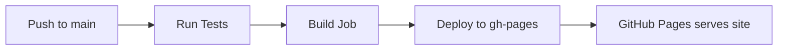

# GitHub Pages Deployment Guide

## Quick Fix Applied ✅

The workflow has been updated to deploy from the `./src` directory where your `index.html` file is located.

**Changed:**
- `publish_dir: ./` → `publish_dir: ./src`

## GitHub Pages Setup Checklist

### 1. Repository Settings

Navigate to your repository settings:

1. Go to **Settings** > **Pages**
2. **Source**: Select "Deploy from a branch"
3. **Branch**: Select `gh-pages` branch
4. **Folder**: Select `/ (root)`
5. Click **Save**

### 2. GitHub Actions Permissions

Ensure GitHub Actions has permission to deploy:

1. Go to **Settings** > **Actions** > **General**
2. Scroll to **Workflow permissions**
3. Select **"Read and write permissions"**
4. Check **"Allow GitHub Actions to create and approve pull requests"**
5. Click **Save**

### 3. Verify Branch Protection

If you have branch protection rules:

1. Go to **Settings** > **Branches**
2. Edit branch protection rule for `main`
3. Under **"Require status checks to pass"**, ensure your CI jobs are listed
4. Make sure **"Require branches to be up to date"** is checked

## How the Deployment Works

### Workflow Flow



### Deployment Steps

1. **Trigger**: Push to `main` branch
2. **Test**: Runs all unit tests
3. **Build**: Validates HTML structure
4. **Deploy**: Copies `src/` contents to `gh-pages` branch
5. **Publish**: GitHub Pages serves from `gh-pages` branch

## Current Deployment Configuration

```yaml
publish_dir: ./src          # Deploy from src directory
publish_branch: gh-pages    # Deploy to gh-pages branch
exclude_assets: ''          # No exclusions (src is clean)
```

## Troubleshooting Common Issues

### Issue 1: Workflow Not Running

**Symptoms:**
- No GitHub Actions workflows appearing
- Actions tab is empty

**Solutions:**

1. **Check if Actions are enabled:**
   - Settings > Actions > General
   - Enable "Allow all actions and reusable workflows"

2. **Verify workflow file location:**
   ```bash
   # Should exist at:
   .github/workflows/ci.yml
   ```

3. **Push to trigger:**
   ```bash
   git add .github/workflows/ci.yml
   git commit -m "Update workflow"
   git push origin main
   ```

### Issue 2: Tests Failing

**Symptoms:**
- Red X on commits
- Deployment doesn't happen
- "Test" job fails

**Solutions:**

1. **Run tests locally:**
   ```bash
   npm test
   ```

2. **Check test output:**
   - Go to Actions tab
   - Click the failed workflow
   - View test job logs

3. **Fix failing tests:**
   - Update test files if HTML structure changed
   - Ensure all paths are correct (`../src/index.html`)

### Issue 3: Deployment Not Happening

**Symptoms:**
- Tests pass but no deployment
- No `gh-pages` branch created

**Solutions:**

1. **Check workflow conditions:**
   - Must push to `main` branch (not develop)
   - Must be a push event (not PR)
   - Tests must pass

2. **Verify permissions:**
   - Settings > Actions > General
   - Enable write permissions

3. **Check deploy step logs:**
   - Actions tab > Build and Deploy job
   - Look for "Deploy to GitHub Pages" step

### Issue 4: 404 Error on Site

**Symptoms:**
- Site deploys but shows 404
- URL doesn't work

**Solutions:**

1. **Check GitHub Pages settings:**
   - Settings > Pages
   - Verify source is set to `gh-pages` branch

2. **Verify gh-pages branch:**
   ```bash
   git fetch origin gh-pages
   git checkout gh-pages
   ls  # Should see index.html, css/, js/ folders
   ```

3. **Check file paths in HTML:**
   - CSS: `href="css/styles.css"` (not `/css/styles.css`)
   - JS: `src="js/navigation.js"` (not `/js/navigation.js`)

4. **Wait for deployment:**
   - Can take 1-5 minutes after push
   - Check Actions tab for completion

### Issue 5: CSS/JS Not Loading

**Symptoms:**
- Site loads but unstyled
- JavaScript not working

**Solutions:**

1. **Check relative paths in index.html:**
   ```html
   <!-- Correct (relative) -->
   <link rel="stylesheet" href="css/styles.css">
   <script src="js/navigation.js"></script>

   <!-- Wrong (absolute from root) -->
   <link rel="stylesheet" href="/css/styles.css">
   <script src="/js/navigation.js"></script>
   ```

2. **Verify file structure in gh-pages:**
   ```
   gh-pages branch:
   ├── index.html
   ├── css/
   │   └── styles.css
   └── js/
       ├── navigation.js
       ├── animations.js
       └── duck.js
   ```

3. **Check browser console:**
   - Open DevTools (F12)
   - Look for 404 errors
   - Fix paths accordingly

## Manual Deployment (Fallback)

If automated deployment isn't working, you can deploy manually:

### Option 1: Using gh-pages npm package

```bash
# Install gh-pages
npm install --save-dev gh-pages

# Add to package.json scripts
"deploy": "gh-pages -d src"

# Deploy
npm run deploy
```

### Option 2: Manual Branch Creation

```bash
# Create gh-pages branch
git checkout --orphan gh-pages

# Remove all files except src
git rm -rf .
git checkout main -- src

# Move src contents to root
mv src/* .
rm -rf src

# Commit and push
git add .
git commit -m "Deploy to GitHub Pages"
git push origin gh-pages

# Switch back to main
git checkout main
```

## Deployment Verification

### Step-by-Step Verification

1. **Push to main:**
   ```bash
   git add .
   git commit -m "Test deployment"
   git push origin main
   ```

2. **Check Actions tab:**
   - Should see workflow running
   - Wait for all checks to pass (green checkmarks)

3. **Verify gh-pages branch:**
   - Go to Code tab > Switch branches > gh-pages
   - Should see index.html and folders

4. **Check GitHub Pages:**
   - Settings > Pages
   - Should show: "Your site is published at..."
   - Click the URL

5. **Test the site:**
   - Navigate to all sections
   - Verify CSS loads (purple theme)
   - Test duck clicking (should quack)

## Deployment Status Commands

Run these to check deployment status:

```bash
# Check if gh-pages branch exists
git ls-remote --heads origin gh-pages

# View last deployment commit
git log origin/gh-pages -1

# Compare main and gh-pages
git diff main origin/gh-pages

# Force sync (if needed)
git push origin main --force
```

## Performance Optimization

After deployment, run these checks:

1. **PageSpeed Insights:**
   - https://pagespeed.web.dev/
   - Test your live URL

2. **Lighthouse in GitHub Actions:**
   - Already configured in workflow
   - Check Actions tab > Lighthouse job

3. **Mobile-Friendly Test:**
   - https://search.google.com/test/mobile-friendly
   - Verify mobile optimization

## Continuous Deployment

Your site will auto-deploy when you:

- ✅ Push to `main` branch
- ✅ Merge PR to `main`
- ✅ Manually trigger workflow (Actions > CI/CD Pipeline > Run workflow)

Your site will **NOT** deploy when you:
- ❌ Push to `develop` branch
- ❌ Create a pull request
- ❌ Tests fail

## Monitoring Deployments

### GitHub Actions Badge

Add this to your README.md:

```markdown
[](https://github.com/shelb-doc/shelby-doc-portfolio/actions/workflows/ci.yml)
```

### Email Notifications

1. Go to your GitHub profile > Settings > Notifications
2. Enable "Actions" notifications
3. Get emails on deployment success/failure

### Deployment Webhook

For advanced monitoring, set up a webhook:

1. Settings > Webhooks > Add webhook
2. Payload URL: Your monitoring service
3. Select "Workflow runs" event

## Common File Structure Issues

### ✅ Correct Structure

```
src/
├── index.html          ← Entry point
├── css/
│   └── styles.css     ← Relative: css/styles.css
└── js/
    ├── navigation.js  ← Relative: js/navigation.js
    ├── animations.js
    └── duck.js
```

### ❌ Wrong Structure

```
# Don't do this:
root/
├── src/
│   └── index.html
├── css/               ← Wrong location
└── js/                ← Wrong location
```

## Quick Commands Reference

```bash
# View deployment status
gh workflow view

# Trigger deployment manually
gh workflow run ci.yml

# View workflow logs
gh run list
gh run view <run-id>

# Check GitHub Pages status
gh api repos/shelb-doc/shelby-doc-portfolio/pages
```

## Need Help?

If deployment still isn't working:

1. **Check Actions tab** for error messages
2. **Review logs** for each failed step
3. **Verify permissions** in repository settings
4. **Test locally** with `npm run serve`
5. **Open an issue** with error logs

## Resources

- [GitHub Pages Documentation](https://docs.github.com/en/pages)
- [GitHub Actions Documentation](https://docs.github.com/en/actions)
- [peaceiris/actions-gh-pages](https://github.com/peaceiris/actions-gh-pages)

---

**Last Updated**: January 2026
**Status**: ✅ Fixed - Deploying from `./src`
